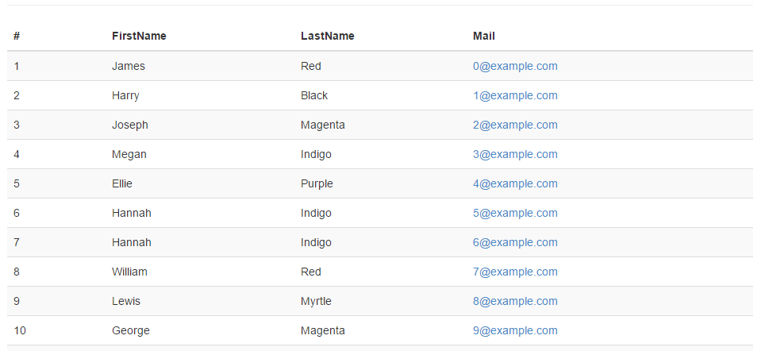
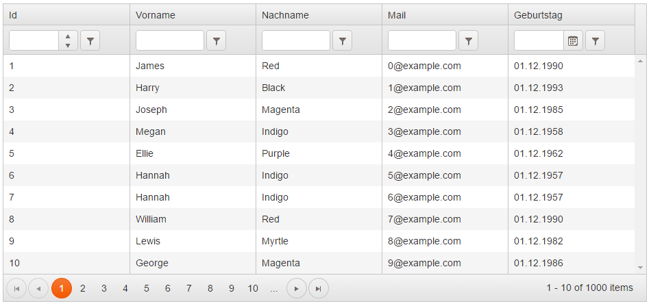

# Einstieg in AngularJS - Lektion 3: Daten Laden und schick darstellen

## Die Geschäftslogik

Alle Beispiele basieren auf einer simplen Geschäftslogik mit zwei Entitäten. Es gibt somit die Entität "Kunde", welche eine beliebige Anzahl an Rechnungen besitzen kann.

~~~~~
GET http://example.org/api/Customers
~~~~~  

Dieser Web API Controller lässt sich über den `$http`-Service von AngularJS aufrufen. Der Service akzeptiert einen String oder ein Konfigurations-Objekt. Der Rückgabewert der Methode ist ein "promise"-Objekt, welches die Methoden "success" und "error" besitzt. Über diese beiden Methoden lassen sich Callbacks für einen erfolgreichen bzw. fehlerhaften Aufruf registrieren. Das Listings 1c zeigt den vollständigen Code, um Daten per `$http` zu laden. 

##### Listing 1c -- listing1controller.js: AngularJS Controller fragt Daten per GET ab
~~~~~
define(['angular'], function(angular) {

    return angular.module('listing1', [])
        .controller('listing1Controller', [
            '$scope', '$http', function($scope, $http) {

                $scope.customers = [];

                $http.get('/api/Customers').success(function(data) {
                    $scope.customers = data;
                });
            }
        ]);
});
~~~~~ 

Die empfangenen Daten werden anschließend mittels `ng-repeat` und dem CSS-Framework Bootstrap [1] tabellarisch dargestellt (siehe Listing 1d).

##### Listing 1d -- listing1.html: AngularJS Template rendert Daten als Tabelle
~~~~~

    <table class="table table-striped">
        <thead>
            <tr>
                <th>#</th>
                <th>FirstName</th>
                <th>LastName</th>
                <th>Mail</th>
            </tr>
        </thead>
        <tbody>
            <tr ng-repeat="customer in customers">
                <td ng-bind="customer.Id"></td>
                <td ng-bind="customer.FirstName"></td>
                <td ng-bind="customer.LastName"></td>
                <td></td>
            </tr>
        </tbody>
    </table>

~~~~~ 

##### [Abb. 2] Die Tabelle aus Listing 1d im Bootstrap-Design

## Tabellarische Daten mit OData anzeigen 

So wie der Web API Controller aus Listing 1b implementiert wurde, wird ein Aufruf der Ressource ohne weitere Parameter eine Liste aller Entitäten zurückgeben. Es wird hierbei tatsächlich der gesamte Inhalt der Datenbank-Tabelle verwendet! Je mehr Daten vorhanden sind, desto unbrauchbarer wird dieser Ansatz. Das OData Protokoll [2] ist gut geeignet, um die Datenmenge enzuschränken. Die notwendigen Parameter heißen `$top` und `$skip`. `$top` gibt *n* Elemente der Ergebnismenge zurück. `$skip` überspringt *n* Elemente in der Ergebnismenge. Möchte man z.B. die Kunden mit der fortlaufenden Nummer 3 bis 7 abrufen, so verwendet man folgenden Aufruf:

~~~~~
GET http://example.org/odata/CustomersApi?$top=5&$skip=2
~~~~~

Weitere Query-Parameter sind unter anderem `$filter`, `$orderby`, `$count` oder `$search`. 

### Beispiele
* Metadaten Dokument abrufen: **/odata/$metadata**
* Paging: /odata/Customers?$top=5&$skip=2
* Paging mit Count: /odata/Customers?$top=5&$skip=2&$inlinecount=allpages
* Filtern: /odata/Customers?$filter=FirstName eq 'Hans'

Der Controller unterstützt nun eine seitenweise Ausgabe, Sortierung und Filterung. Diese Fähigkeiten direkt mit AngularJS umzusetzen wäre ein großer Aufwand. Es bietet sich an, ein fertiges Tabellen-Control ("Grid") zu verwenden. Auf dem Markt finden sich eine Reihe von freien und proprietären Grids, welche mit AngularJS kompatibel sind. Ein bekanntes und weit verbreitetes Framework ist Kendo UI von Telerik [3]. Listing 2c und Listing 2d zeigen die Verwendung des Kendo UI Grids im Zusammenspiel mit AngularJS und OData.

##### Listing 2c -- listing2controller.js: Die Datenquelle des Grids muss konfiguriert werden
~~~~~
define(['angular', 'kendo'], function(angular) {

    return angular.module('listing2', ['kendo.directives'])
        .controller('listing2Controller', [
            '$scope', function($scope) {

                $scope.customerDataSource = new kendo.data.DataSource({
                    type: 'odata',
                    transport: {
                        read: {
                            type: 'GET',
                            url: '/odata/Customers',
                            dataType: 'json'
                        }
                    },
                    schema: {
                        data: function (data) { return data.value; },
                        total: function (data) { return data['odata.count']; },
                        model: {
                            id: 'Id',
                            fields: {
                                Id: { type: 'number' },
                                FirstName: { type: 'string' },
                                LastName: { type: 'string' },
                                Mail: { type: 'string' },
                                DateOfBirth: { type: 'date' }
                            }
                        }
                    },
                    serverPaging: true,
                    serverSorting: true,
                    serverFiltering: true,
                    pageSize: 10
                });
            }
        ]);
});
~~~~~

##### Listing 2d -- listing2.html: Eine AngularJS Direktive wrappt das KendoUI Grid-Control
~~~~~

~~~~~  

##### [Abb. 3] Das Kendo UI Grid aus Listing 2d

Im Kern ist Kendo UI ein Framework, welches aus diversen jQuery-Plugins besteht. Normalerweise ist die Integration von jQuery-Plugins in AngularJS mit Aufwand verbunden. Doch der Hersteller liefert über das AngularJS Modul `kendo.directives` gleich passende Direktiven für AngularJS mit. Die Datenquelle "customerDataSource" beschreibt das Modell und die Fähigkeiten des OData Services im Detail. Um die Übersichtlichkeit zu erhöhen, wurde die Datenquelle nicht im Markup konfiguriert. Man könnte übrigens in einem künftigen Refactoring-Schritt die Datenquelle in einen eigenen AngularJS Service auslagern. 

## Optional: Daten mit OData und Breeze.js abrufen

Nun gilt es, mithilfe von Metadaten und URL-Konventionen die Entwicklung eigener Funktionalitäten zu vereinfachen. Weder die Low-Level API von `$http`, noch das Angular-Modul `ngResource` sind dafür gut geeignet. Man benötigt ein Framework, welches die Komplexität von OData auf ein verständliches Niveau abstrahiert.

Die gesuchte Abstraktion bietet das Open-Source Framework "Breeze.js" an [4]. Für die OData Integration wird wiederum auf das Framework "data.js" [5] zurück gegriffen.   Breeze.js verwendet zudem den internen Promise-Service `$q` von AngularJS, was Unit-Tests entscheidend vereinfacht. .NET Entwicklern wird Breeze.js sehr vertraut vorkommen. Das Framework ist stark vom Entity Framework und LINQ inspiriert. Das verwendete Modell ergibt sich stets aus den Metadaten. Konzepte wie "Change Tracking", das Unit of Work Pattern ("Batched saves"), "Navigation Properties" oder einen internen Speicher für Entitäten ("Client-side caching") sind aus dem Entity Framework bestens bekannt. Listing 4 zeigt, wie man alle Kunden mit dem Vornamen "Jack" komfortabel abfragt.

##### Listing 4 -- listing4controller.js: OData Service mit Breeze.js abfragen
~~~~~
define(['angular', 'breeze.angular'], function(angular) {

    return angular.module('listing4', ['breeze.angular'])
        .controller('listing4Controller', [
            '$scope', 'breeze', function($scope, breeze) {

                breeze.config.initializeAdapterInstance('dataService', 'webApiOData', true);
                var manager = new breeze.EntityManager('/odata');

                new breeze.EntityQuery()
                    .using(manager)
                    .from("Customers")
                    .orderBy("FirstName")
                    .where("FirstName", "eq", "Jack")
                    .execute()
                    .then(function(data) {
                        $scope.customers = data.results;
                    });
            }
        ]);
});
~~~~~

Ein interessantes Feature ist die Unterstützung von Navigation-Properties mittels "$expand". Folgendes Beispiel demonstriert, wie man den Kunden Nr. 42 und gleichzeitig all seine Rechnungen mit einem Aufruf lädt:    
 
##### Listing 5 -- listing5controller.js: Verwendung von Navigation-Properties in Breeze.js (Ausschnitt)
~~~~~
new breeze.EntityQuery()
    .using(manager)
    .from("Customers")
    .where("Id", "eq", 42)
    .expand("Invoices")
    .execute()
    .then(function(data) {
        $scope.customer = data.results.length ? data.results[0] : null;
    });
~~~~~

## Aufgaben

1. Verändere das Theme von Bootstrap!
2. Füge weitere Kendo-UI Controls zur Anwendung hinzu.

[1] Bootstrap: http://getbootstrap.com/
[2] OData Version 4.0 - URL Conventions - http://docs.oasis-open.org/odata/odata/v4.0/odata-v4.0-part2-url-conventions.html  
[3] Kendo UI - http://www.telerik.com/kendo-ui1  
[4] Breeze.js - http://www.breezejs.com/  
[5] Data.js - http://datajs.codeplex.com/  